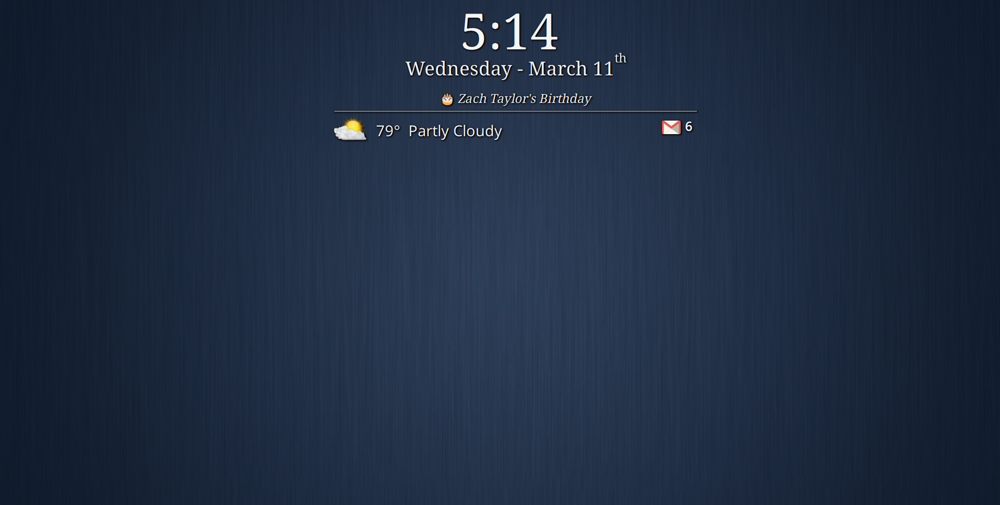

# Custom Plasma Lockscreen

## Modifications
* Display unread gmail messages count, current weather temp and conditions
* Calendar events - using any web ical
* kb/mouse movement, hide clock and status info, show login/password Ui

An attempt to get an android type lockscreen  
Or what i learned using linux for 2 years.  
click image for a short video demo

{:target="_blank"}

### How it works:
For security reasons, kscreenlocker does not allow internet acesss, 
this is a hack using local files as JS variables  
Modified Breeze plasma qml files to get the desired effects. Designed for 1920x1080 screens.  
Using javacript node and python to create JS variables written to file system  
The JS variables are used within qml losckreen files and systemd scripts to update them.  
I am not a QML/QT expert, maybe someone with better skills could do this more efficently.

## Requirements:
* KDE Plasma 5.15, Node JS server, python3, systemd
* Node JS server - https://nodejs.dev/
* Weather function from https://github.com/nahidulhasan/nodejs-weather-app  
      * OpenWeather https://openweathermap.org/api
* Weather forecast from https://github.com/josephjguerra/node-weather-forecast-command-line  
      * https://www.wunderground.com/signup
* Python script for gmail https://github.com/akora/gmail-message-counter-python
* National Day Calendar - https://natdaycal.wordpress.com/
* Gmail Oauth https://developers.google.com/gmail/api/quickstart/python
* Plasma Look And Feel Explorer installed as plasma-sdk from your distro repo
      https://userbase.kde.org/Plasma/Create_a_Look_and_Feel_Package
* Some knowledge of node javascript,python,plasma qml files,linux systemd

### Installation at your own risk ;)  Backup original files so u can revert back.

* Extract all files to home directory / lockscreen
* From github - https://github.com/akora/gmail-message-counter-python modify for your inbox, setup Oauth credentials
   ** Modified to write to a file the unread mail count, add categories - updates, social, 
      use counter.py provided, instead of one from github
   ** See https://developers.google.com/gmail/api/quickstart/python for more info
* Install node js server within that folder
* Install node ical, fs, weather
* natday1.js is the event info JS, change location to write variable file
* modify weather scripts enter api keys, your city and change location to write js variable file
   within the nodejs-weather-app-master folder edit index.js and change city name   
    const city = location || 'City Name, State USA';
* Extract MyBreeze.zip to $home/.local/share/plasma/look-and-feel/MyBreeze/  
   ** Custom Breeze theme for testing the qml and JS script
* Copy systemd scripts to systemd folder and start and enable services
* Edit supplied qml files to change location of JS variables for your system
* Copy qml files to the new theme folder created

### Testing 
___________
* Change global theme to new MyBreeze theme  
  ** test lockscreen with  
      /usr/lib/kscreenlocker_greet --testing --theme /home/hammer/.local/share/plasma/look-and-feel/MyBreeze   
* Test ical event info with > with node natday1.js  will retrieve calendar event and create  
   natday.js variable file used in Clock.qml
* Test current weather info with > node index.js will retrieve temperature info and create temp.js  
  variable file used in Clock.qml
  * Test weather forecast with >  node forecast.js  
* Test gmail count with python3 counter.py - use counter.py provided,  
    will retrieve unread mail count info and create gmail.js 
* Test Lockscreen with /usr/lib/kscreenlocker_greet --testing --theme /home/.local/share/plasma/look-and-feel/MyBreeze
* Verify SYSTEMD settings in System Settings  > SYSTEMD > TIMERS  - should be a description of the timers installed above.

### Notes
____________
* node js server required for js scripts
* ical, fs, weather-app install required to work
* using node JS functions and systemd to run the scripts at certain times to keep lockscreen current
* you must edit the qml files to reflect the location of these files, also the node JS files must be changed 
    to reflect the location to write the JS variable files
* optional - modify natday1.js to your own public event calendar
* weather function from https://github.com/nahidulhasan/nodejs-weather-app - 
       modified to write to file, use provided index.js to get the file system write logic

#### Node JS functions
* node natday1.js creates file called natday.js which is used in Clock.qml as a variable with import statement
* node weather creates file called temp.js which is used in Clock.qml as a variable with import statement
* weather function from https://github.com/nahidulhasan/nodejs-weather-app - modified to write to file instead of console

#### Python 3 functions
* python3 counter.py calls gmail to get unread mail messages and creates a file gmail.js  used in Clock.qml as a variable with import statement

### TODO:
_________
* exract image metadata exif for description / location -- good for images from usplash/wallhaven/reddit earthporn
* idea for kde - allow trusted apps / widgets access to lockscreen
